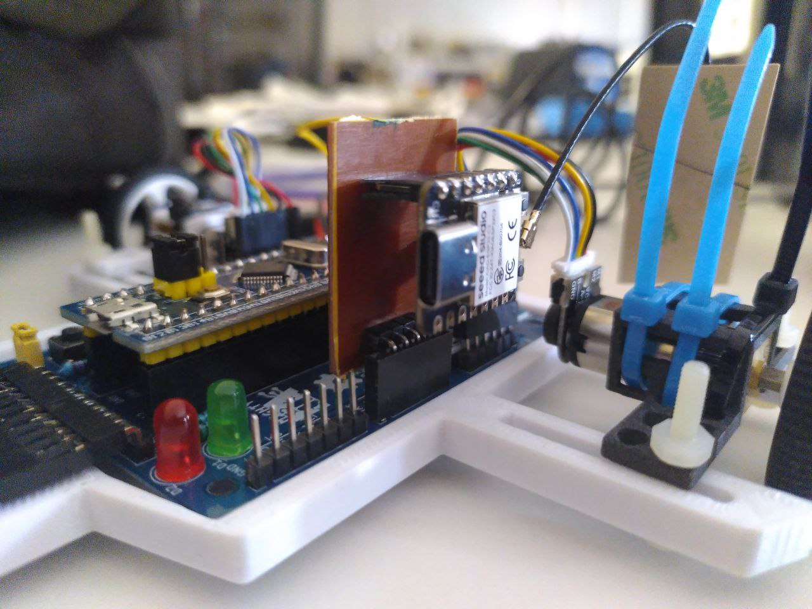

# WiFi Serial Gateway for the RustyBugA

Firmware and tools for a Seeed Studio XIAO C3 based serial gateway that uses WiFi as wireless interface.



# Usage
## Hardware connections
TBD

## Connect from the PC using USB (like an FTDI)
> Remember to remove the jumper when the USB cable is not connected.

Make all the connections and:
```
picocom /dev/ttyACM3 -b 115200
```

Currently, this interface only prints logs.

## Connect from the PC using netcat (like an FTDI but wireless!)
> Remember to use the jumper when the USB cable is not connected.

Connect the PC to the same network as the gateway and use the mDNS name to create a connection:
```
nc -u ${MDNS_NAME}.local 1234
```
now data can be exchanged with the robot.

If you don't know the MDNS_NAME, it is printed over the USB link at start.

## Connect from the PC using tools
TBD

